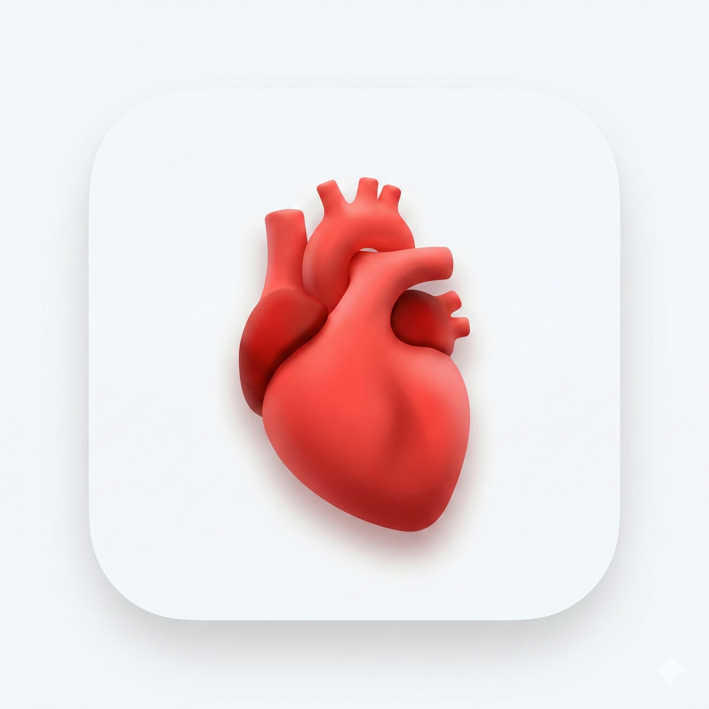

<div align="center">
  
  
  <a href="https://git.io/typing-svg">
    
  </a>

  <p>
    <a href="https://mzaid-dev.github.io/omnicare/"></a>
  </p>

  <p>
    <a href="#"></a>&nbsp;
    <a href="#"></a>&nbsp;
    <a href="#"></a>
  </p>

  ## OmniCare Demo

  **Get the Latest Production Build**
   <br>
  <a href="https://github.com/mzaid-dev/omnicare/releases/latest/download/omnicare-android.apk">
    
  </a>
  &nbsp;
  <a href="https://github.com/mzaid-dev/omnicare/releases/latest/download/omnicare-setup.exe">
    
  </a>
  &nbsp;
  <a href="https://github.com/mzaid-dev/omnicare/releases/latest/download/omnicare-web.zip">
    
  </a>
  &nbsp;
  <a href="https://omnicare.vercel.app/">
    
  </a>


</div>

<br>

## 📸 Interactive Mockups

<div style="overflow-x: auto; white-space: nowrap; padding-bottom: 20px;">
  
  
  
  
</div>

<br>

## 🎨 Overview

**OmniCare** is a senior-level Flutter wellness dashboard designed to showcase high-fidelity design patterns, seamless animations, and scalable architecture. It allows users to track interactive health metrics across major organs, book appointments, and manage a medical profile within a cohesive, modern interface.

Built for **performance and scalability**, this project emphasizes clean code principles, modular structure, and production-ready UI/UX standards.

<br>

<div align="center">
  
  <br>
  <i><b>Official App Icon</b></i>
</div>

<br>

## ✨ Key Technical Decisions

<table border="0">
  <tr>
    <td width="50%" valign="top">
      <h3>🚀 Feature-First Architecture</h3>
      <p>Organized by module (Home, Appointments, Profile) for maximum scalability and low coupling, ensuring the codebase is ready for production teams.</p>
    </td>
    <td width="50%" valign="top">
      <h3>🛣️ Declarative Routing</h3>
      <p>Powered by <code>go_router</code> for robust shell navigation and seamless deep-linking support across all mobile and web platforms.</p>
    </td>
  </tr>
  <tr>
    <td width="50%" valign="top">
      <h3>📊 High-Fidelity Graphics</h3>
      <p>Optimized <code>fl_chart</code> implementation with custom gradient overlays and elastic spring animations for a premium data visualization experience.</p>
    </td>
    <td width="50%" valign="top">
      <h3>🌊 Fluid Micro-Interactions</h3>
      <p>Custom <code>AnimatedPositioned</code> logic and shared-element Hero transitions that define a cohesive and engaging user journey.</p>
    </td>
  </tr>
</table>

## 🛠️ Powered By

<div align="center">
  <br>
  
  
  <br>

  | Core Tech | UI Utilities |
  | :--- | :--- |
  | **Flutter SDK 3.19+** | `fl_chart` (Visualization) |
  | **Dart 3.0+** | `go_router` (Navigation) |
  | **Production Architecture** | `google_fonts` (Typography) |

</div>

<br>

## 📂 Architecture

Designed for **readability** and **modularity**.

```
lib/
├── app/                # 🎨 Theme & Global Routing
├── core/               # 📦 Assets & Shared Constants
├── features/           # 🧩 Modular Business Features
│   ├── home/           #    - Dashboard & Charts
│   ├── appointments/   #    - Booking System
│   └── profile/        #    - Collapsing User Stats
└── shared/             # 🛠️ Global UI Components
```

<br>

## 🚀 Getting Started

1.  **Clone** the repository:
    ```bash
    git clone https://github.com/mzaid-dev/omnicare.git
    ```
2.  **Install** dependencies:
    ```bash
    flutter pub get
    ```
3.  **Run** on your preferred platform:
    ```bash
    flutter run
    ```

<br>

---

<div align="center">
  <br>
  
  <h3>👨‍💻 Developed with ❤️ by Muhammad Zaid</h3>

  <p>
    <a href="https://github.com/mzaid-dev"></a>
    &nbsp;&nbsp;
    <a href="https://linkedin.com/in/mzaid-dev"></a>
    &nbsp;&nbsp;
    <a href="mailto:dev.mzaid@gmail.com"></a>
  </p>
  
  
</div>